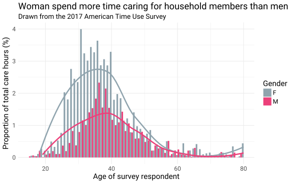

# A Set of Contributed Graphs with brief Commentary

## Authors

- David Firth
- James Walsh
- (next name to be added here)

(add your name to the above list when you have contributed your file)

## The contributions

### DAVID F

    08 10 14

This plot shows how participation in religious and spiritual activity in the USA is different at different ages.  The graph is based on data from the 2017 American Time Use Survey, in which
respondents recorded how they spent all of their time on the day before they were interviewed.
The above graph shows the percentage of respondents, at different ages, who reported that they had spent any time at all on religious and spiritual activity on the day in question.

The graph shows how such participation increases from less than 10% of 20-year-olds, to 20% or more of the oldest survey respondents.  It should be noted that the data for the very oldest respondents --- those aged 80 and over --- is less reliable than at other ages, partly because of small numbers and partly because of the rounded recording of older ages in the published ATUS data.
    
**The above is just an illustrative example of the sort of graph and text you might include in this file.  I fully expect that some of the graphs you'll produce will be more interesting than this one!**

          	
### ALEXANDER

    01 06 13

### BAIYUN

    08 13 18    

### BENJAMIN A

    01 05 08
     
### BENJAMIN S

    10 13 18
    
### CHRISTOPHER

    10 14 16
    
### DANA

    05 12 18

### DANIEL

    03 05 11

### DANIUS

    06 11 14
    
### DAVID

    01 02 05
    
### DENIS

    02 03 12
    
### FAN

    06 11 16
    
### HARRISON

    05 15 16
    
### JAMES

    03 08 14
    

The above figure conveys an inequality in both gender and age of individuals caring for members within the American home. Participants of the 2017 American Time Use Survey (ATUS) were expected to note how many hours of the day before their interview they had spent on various tasks. In the graph, we may see the proportion of the total reported hours directed to this care, split by age and sex.

Of all reported hours caring for others within their home, across almost all ages, females (grey) report a higher number of hours than males (pink). Secondly, younger woman (25-35) spend considerably more time on this task than men of the same age range. Interestingly, men do show a clear peak in their late thirties, perhaps correlated to their aging parents seeking their help. The trend lines are provided solely for illustrative purposes of indicating the distinct differences in proportions, as they have not been statistically scrutinized. Similarly, the tails of these rough distributions, and hence these data, should be considered somewhat unreliable due to small sample size within these age ranges.

    
### JAN

    04 13 15
    
### JIA

    07 08 18
    
### LANGLANG

    02 11 18
    
### LEWEI

    01 06 08
    
### LUYING

    06 08 15
    
### MACIEJ

    12 16 18
    
### MAHIR

    04 06 16
    
### MARIIA

    02 06 11
    
### MAXIM

    12 13 16
    
### MICHAEL

    04 10 12
    
### MINWOO

    04 08 12
    
### NAIXUAN

    08 14 16
    
### NATHAN

    11 12 15
    
### NEEL

    04 07 15
    
### NICOLE

    02 06 11
    
### NIRAJ

    03 06 13
    
### OPEOLORUN

    05 16 18
    
### REECE

    09 10 12
    
### RICHARD

    04 11 12
    
### SAMUEL

    06 09 13
    
### SANDEEP

    02 04 15
    
### SOPHIE

    04 12 18
    
### TIMOTHY

    06 09 11
    
### XI

    03 05 06
    
### XINGWEI

    01 03 07
    
### YIWEN

    02 10 14
    
### YUE

    03 12 18
    
### ZECHI

    01 04 07
    
### ZILIN

    04 10 15

