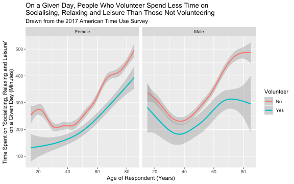

# A Set of Contributed Graphs with brief Commentary

## Authors

- David Firth
- Nathan Mullins
- (next name to be added here)

(add your name to the above list when you have contributed your file)

## The contributions

### DAVID F

    08 10 14

This plot shows how participation in religious and spiritual activity in the USA is different at different ages.  The graph is based on data from the 2017 American Time Use Survey, in which
respondents recorded how they spent all of their time on the day before they were interviewed.
The above graph shows the percentage of respondents, at different ages, who reported that they had spent any time at all on religious and spiritual activity on the day in question.

The graph shows how such participation increases from less than 10% of 20-year-olds, to 20% or more of the oldest survey respondents.  It should be noted that the data for the very oldest respondents --- those aged 80 and over --- is less reliable than at other ages, partly because of small numbers and partly because of the rounded recording of older ages in the published ATUS data.
    
**The above is just an illustrative example of the sort of graph and text you might include in this file.  I fully expect that some of the graphs you'll produce will be more interesting than this one!**

          	
### ALEXANDER

    01 06 13

### BAIYUN

    08 13 18    

### BENJAMIN A

    01 05 08
     
### BENJAMIN S

    10 13 18
    
### CHRISTOPHER

    10 14 16
    
### DANA

    05 12 18

### DANIEL

    03 05 11

### DANIUS

    06 11 14
    
### DAVID

    01 02 05
    
### DENIS

    02 03 12
    
### FAN

    06 11 16
    
### HARRISON

    05 15 16
    
### JAMES

    03 08 14
    
### JAN

    04 13 15
    
### JIA

    07 08 18
    
### LANGLANG

    02 11 18
    
### LEWEI

    01 06 08
    
### LUYING

    06 08 15
    
### MACIEJ

    12 16 18
    
### MAHIR

    04 06 16
    
### MARIIA

    02 06 11
    
### MAXIM

    12 13 16
    
### MICHAEL

    04 10 12
    
### MINWOO

    04 08 12
    
### NAIXUAN

    08 14 16
    
### NATHAN

    11 12 15

This graph shows how the amount of time spent on socialising, relaxing and leisure (SR&L) in the USA differs depending on whether a person undertakes volunteer activities. The data used to produce this graphic is from the 2017 _American Time Use Survey_, in which respondents were asked to record which activities they had undertaken the previous day, and for how long. 

\
From the graph, regardless of gender, respondents who spent any amount of time volunteering on a given day spent noticeably less time on SR&L than those not volunteering.

\
Looking at males, the amount of time spent by volunteers on SR&L, on a given day, follows a very similar trend to that of non-volunteers. In fact, it appears the trend for time spent on SR&L by volunteers is, for the most part, a scaled down version of the trend for non-volunteers. The only noticeable difference is for males over 70. 
\
For males over 70 the amount of time spent by volunteers on SR&L deviates from the trend observed in non-volunteers; as age increases there is a decrease in the amount of time spent by volunteering males on SR&L. A possible explanation is the wide 95% confidence interval for volunteers over 70, which suggests that only a small proportion of respondents were males over the age of 70 who engaged in volunteering on a given day.

\
Looking at females, there is no overlap of the 95% confidence intervals for time spent on SR&L by volunteers and non-volunteers. This means we can confidently conclude that, across all ages, there is a statistically significant difference between the time spent on SR&L, on a given day, by volunteers and non-volunteers (Note that this does not infer that since male volunteers and non-volunteers overlap there isn't a statistically significant difference).
\
The trend for female volunteers does not match that of the female non-volunteers as closely as the trends for males does. This is particularly true for females under the age of 30. The 95% confidence interval for volunteering females under 30 is much wider than that of non-volunteers. This suggests that, out of all female respondents, relatively few of them under the age of 30 were engaged in volunteering on a given day.

    
### NEEL

    04 07 15
    
### NICOLE

    02 06 11
    
### NIRAJ

    03 06 13
    
### OPEOLORUN

    05 16 18
    
### REECE

    09 10 12
    
### RICHARD

    04 11 12
    
### SAMUEL

    06 09 13
    
### SANDEEP

    02 04 15
    
### SOPHIE

    04 12 18
    
### TIMOTHY

    06 09 11
    
### XI

    03 05 06
    
### XINGWEI

    01 03 07
    
### YIWEN

    02 10 14
    
### YUE

    03 12 18
    
### ZECHI

    01 04 07
    
### ZILIN

    04 10 15

